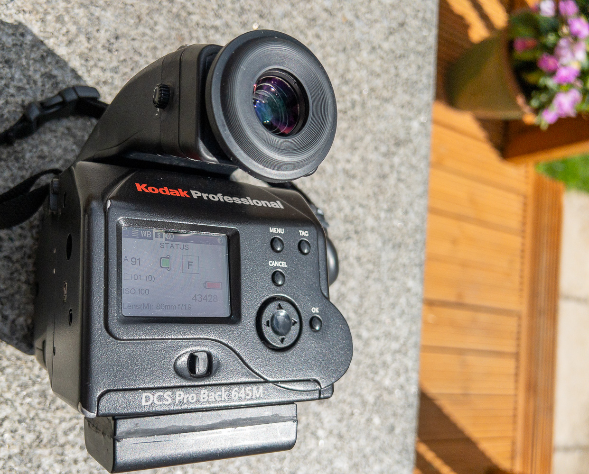
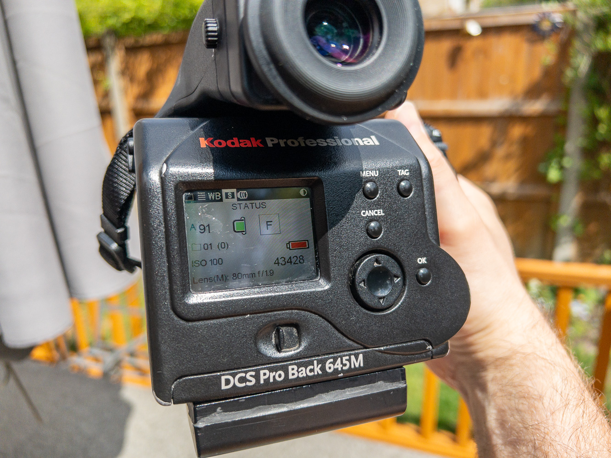
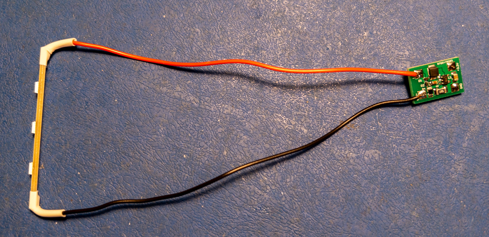
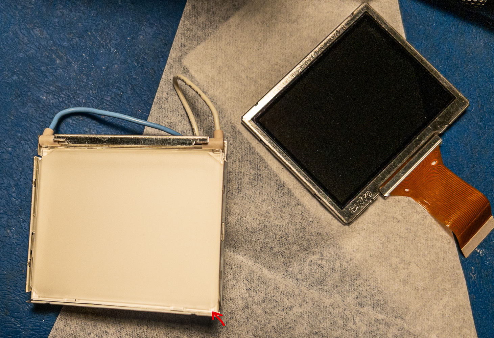
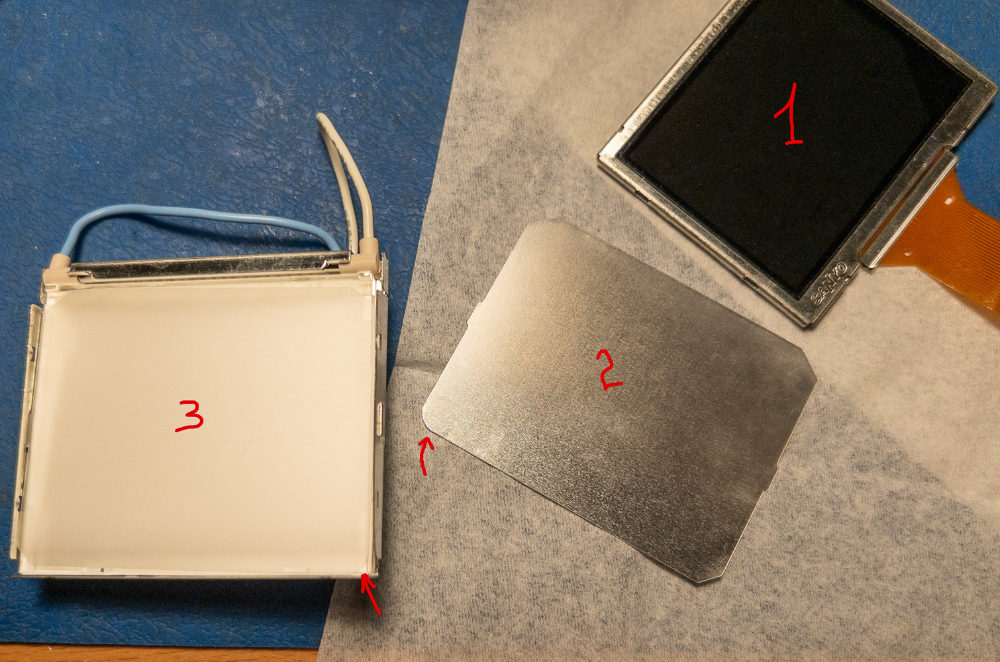
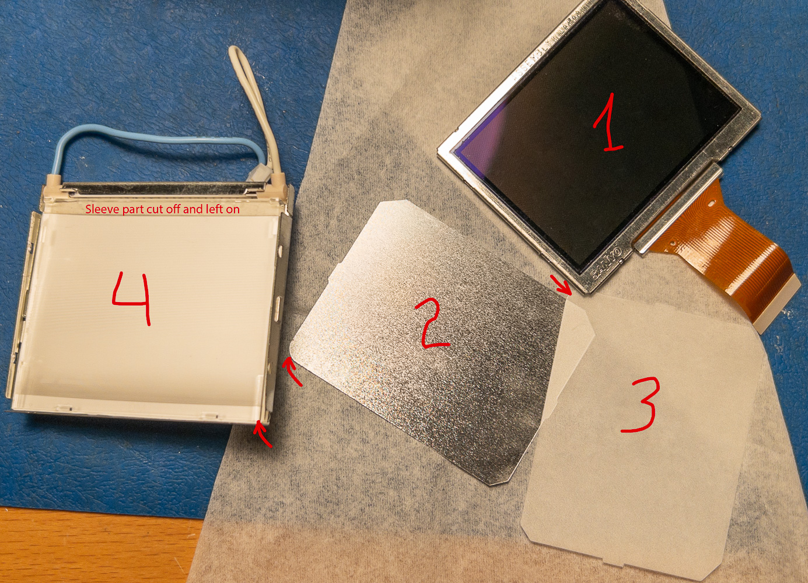
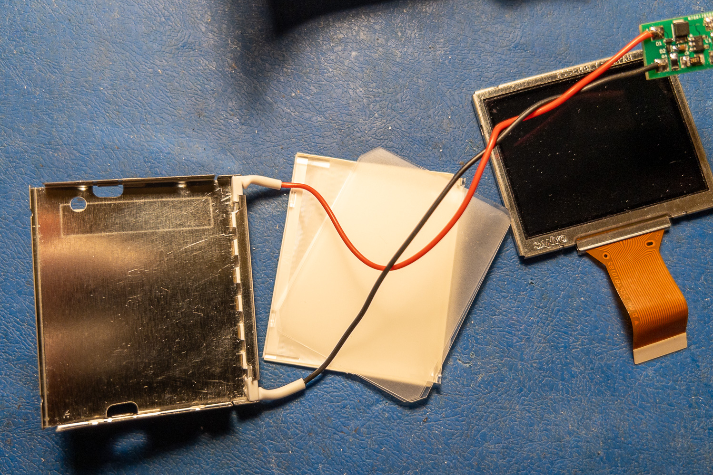
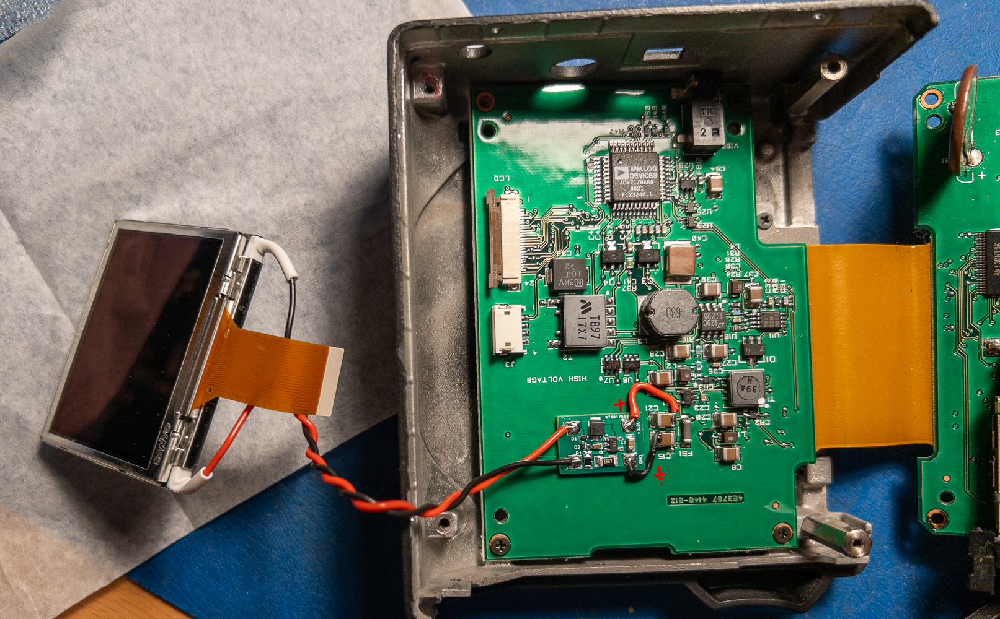
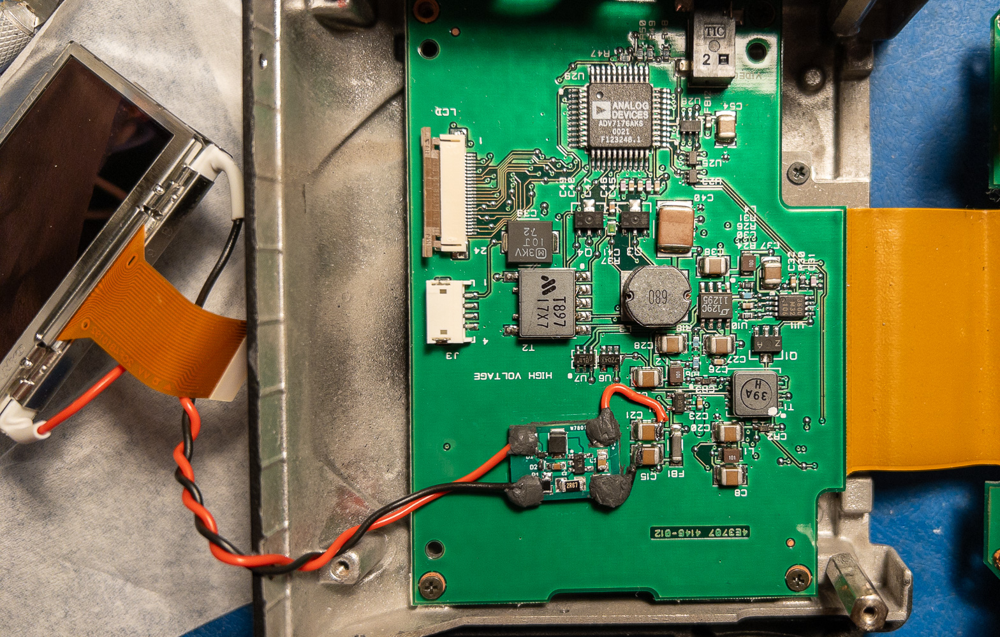

# ProBack screen upgrade to use LED backlighting

Proback is an old digital back using [Sanyo ALP230CCX LCD](Ref/ALP230CCX.pdf) with CCFL tube as backlighting (that was a technology back in 2001). The CCFL tube lights up the edge of the screen and light guide plate with diffusers and light boosting sheets providing a backlight. The backlighting achieved this way is ok to start with but as CCFL tube ages it gets very weak and in a strong daylight practically nothing can be seen on the LCD. Besides CCFL tubes have limited lifespan and cannot be replaced since it is hard to find the sourcereplacemnt of that size nowadays. The aim of this hardware project is a complete replacement of this backlighting system with LED board instead of CCFL tube driven from the same on/off signal as the main backlight. The goal of it is to make it more usable in direct sunlight. This is the end result:

## Project history

This project followed the footsteps of something similar already done [here (link in russian)](https://web.archive.org/web/20171017015512/http://wowcamera.info/viewtopic.php?f=18&t=815&sid=7ef8761ab0095eecd0e935a0096e5fdd&start=740) but does a properly designed LED light source with constant current control.

I have designed the LED boards originally for 3x SMD LEDs in 2835 packages to fit perefecly inside LCD outer casing instead of CCFL. However upon experimenting with that it appears that Sanyo LCD backlight construction uses a light guide plate with straight vertical pattern that may work with linear light source like CCFL tube but does not work well with just a few LEDs creating long vertical beams of light. Modern LCD light guide panels use diaginal pattern that scatter light more evenly. With this in mind I also designed board for 6x SMD LEDs more closely spaced - those will need to be driven at close to a half the rated current to have the same power usage and light output as the 3x LEDs.

The alternative to 6x LED board and direct replacement is to place 3x LED lights sideways to the edge of the light guide - that means the light source needs to be behind the LCD case and holes for the LEDs need to be drilled into metallic frame to allow this ([similar to this](https://web.archive.org/web/20171021101310if_/http://wowcamera.info/download/file.php?id=11161&sid=97ba8f0b739cfa263edd7aab8cd7707e) used in approach from the russian project linked above). The latter approach is more involved than simple drop-in light replacement as this whole LED boards were designed to be but may be better at providing more uniform lighting.

The LED driver board provides constant current source from 3.3V and can be adjusted for your LEDs (by calculating R2 values for your LEDs current and is R2 = 95 mV / LED current mA (also see a note on schematic with a few sample values). The driver board was intentionally designed to be very small to fit onto a free space on ProBack board close to LCD and backlight power source.

Current design was tested with Yuji LEDs [YJ-BC-2835L](https://www.yujiintl.com/bc-2835l-0-2w/) (20-24 lumens per LED at rated current - CRI95). You can also use any other LEDs in 2835 packaging - make sure they have low forward voltage (<3.3V) and not a very high current. The Lumileds White CRI95 LED (manufacturer part number L128-5095HA35000B1) seems to be an ideal alternative that is widely available (it was also specified below in parts list as alternative).

This is assembled driver and LED light source for 3x LEDs designed to go behind LCD frame:

This is assembled driver and LED light source look for 6x LEDs designed to go in place as direct replacement of CCFL tube:

And this is 6x LED light source installed in place of CCFL and powered with LCD off - this shows drawback of this type of lighting caused by the linear structure of light guide panel. It could be addressed by sourcing the replacement for light guide panel with diagonal etching pattern but I have not managed to find any suitable replacement just yet.

Even with the visible backlight pattern, this is far easier to install since it is essentially taking CCFL tube out and placing LED strip board in its place and requires no drilling and no modifications of LCD frame. The brightness here on photo was reduced in postprocessing to show the pattern - in reality the backlight is much brighter.

For the Yuji LEDs above, the board in examples uses regulated LED current of 35mA (with resistor values as selected in schematics and specified in parts list below). For a string of 6 LEDs it produces voltage of 17V (slightly less but that is highly dependent on LED variations). This gives overall power consumption of 595mW which is still slightly less than original CCFL light at 600mW yet it is substantially brighter.

For the 6x LED board of the Yuji LEDs above, I would not recommend to go for brighter than with LED current of 35mA (30..35mA is the ideal range) since it then gets too bright and beyond capabilities of the LCD itself to handle (black becomes too bright). So the resistor values in the list of parts section below reflect this. I personally ended up using 35mA current and it is just about right balance.

This is how it looks all connected and lit:

## What is provided

In this repository you can find Eagle CAD [schematics](LED_Driver_Separate.sch) and [board](LED_Driver_Separate.brd) for LED driver, [schematics](3xLED_Panel.sch) and [board](3xLED_Panel.brd) for 3x LED board and [schematics](6xLED_Panel.sch) and [board](6xLED_Panel.brd) for 6x LED board. I have tested both LED boards but ended up using 6x one as it required no modification to LCD assembly and is more compact.

Separately you can also find [list of parts](BOM.csv) as well.

Gerber files for all the boards are in [Gerbers](Gerbers) subfirectory and are produced for [PCBWay](https://www.pcbway.com/) specifications (they were the only ones I found who can produce LED boards at 3mm minimum width).

When ordering the boards, LED lights board should be finished in white and have a thickness of 1.6mm - this ensures precise fit into a frame and sitting very close to the light guide panel. Minimal board width in PCBWay is 3mm and it is exact size of the gap in LED aluminium frame - so the fit is very tight. I would recommend to file boards a bit to 2.9mm for slightly easier fit.

The driver board for aesthetic reason should be green (to match the main board) and be any thickness of up to 1.6mm - ideally I would choose 0.8mm.

## LCD disassembly and light replacement

LCD assembly in a metal frame is a sandwich consisting of LCD panel itself (1), light boosting sheet of material under it (2), then diffusion sheet of material (3), then light guide acrylic panel (4) with white reflective material behind it and CCFL tube on one of the sides. All of that is packed within a metal frame.

It is relatively straightforward to take apart - LCD panel could be pried apart from the frame via side slots with a small screwdriver. This is how it looks when it is taken away:

Take a note of the corner pointed to by red arrow - the light boosting sheet and diffusing sheet have one rounded corner that goes in only one way in the right bottom corner of the LCD assembly. Next, gently take away light boosting sheet (it has metal sheen on one side):

Then, gently take away diffusion sheet, again noting round corner and where it should go:

All the components here are numbered with their order in the assembly from the top starting with LCD panel.

Lastly, take the light guide assembly from the frame, peel off the CCFL tube with the little white reflective sleeve holding it and discard the tube. Cut off the parts of white sleeve that stick to the light guide panel, both top and bottom bits and stick them both back to the light guide panel (this is important to avoid light bleeds). See the photo above where sleeve was already cut off and both parts were put back on with indication of the top part.

Next, push the LCD light board into the metal frame (it should be pretty tight) as far as it can go:

After that, place all the components back in the reverse order: light guide panel (4), then diffusion sheet (3) noting round corner position, then light boosting sheet (2) noting round corner position and at last put in the LCD panel (1) and click it into place. The LCD assembly is now complete.

## Board attachment

The LED driver board is designed to go on the empty space of the last board connecting to LCD - that sits directly behind CF card slot in the assembled position. Solder two short insulated wires to LED driver board, postion it close to C15 and C21 capacitors and solder ground and + wires as shown on this photo:

Both C15 and C21 are connected in parallel so it really does not matter which one of them the wires are soldered to, but the sides of them: top one for GND and lower side for +3.3V. When soldered, plug in ProBack battery briefly to check backlight working. Then glue the LED driver board to the ProBack board. I used Sugru to attach the board to the main board and insulate the contacts (this is mainly to be able to detach the driver board should I ever need to replace it):

Then attach the LCD connector and put the LCD in place with the ProBack board on top. For added safety, loosely cover LED driver board by Capton tape:

Then assemble the ProBack and test it on camera in the field.

